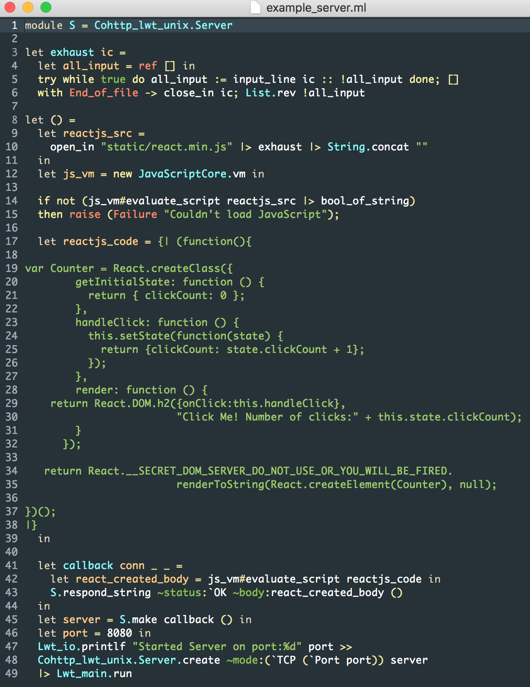

JavaScriptCore in OCaml
==========================

If you understand this image then you understand what this project is
about and what its capable of.



# Installation (Tested on OS X and Ubuntu 14, 15)

`opam` makes this installation very easy, even taking care of system
dependencies for you.

In this directory do:

```shell
$ opam pin add javascriptcore . -y
```

If on Linux then this will probably crap out at first. That is fine,
there will be a `depext` message, follow that message and `opam` will
take care of all the required system dependencies. Then do the `opam
pin` operation again.

# Notes

If building this code with the environment varible `JSC_ML_DEBUG`
defined, then you'll get colored debugging information printed out
from each of the stub functions at the C/C++ layer, for example:

```shell
$ JSC_ML_DEBUG= opam pin add javascriptcore . -y
```

Or during development

```shell
$ JSC_ML_DEBUG= make
```

Or for running the tests..

```shell
$ JSC_ML_DEBUG= make test
```

An example `utop` session:

```shell
─( 16:02:44 )─< command 0 >─────────────────{ counter: 0 }─
utop # #require "javascriptcore";;
─( 16:02:44 )─< command 1 >─────────────────{ counter: 0 }─
utop # let s = new JavaScriptCore.js_string ~ml_string:"Hello World" ();;
[2016-06-16.16:02:47] [value jsc_ml_make_string_with_ml_str(value)]: Creating JSStringRef from OCaml String
val s : JavaScriptCore.js_string = <obj>
```

# Backing 

This project is built with OCaml 4.03.0, C++11, libc++, blocks,
JavaScriptCore. It does not use objective-c and works on Linux.

# Help Wanted

This project has plenty of places to improve your JavaScript, OCaml,
C/C++ coding.
