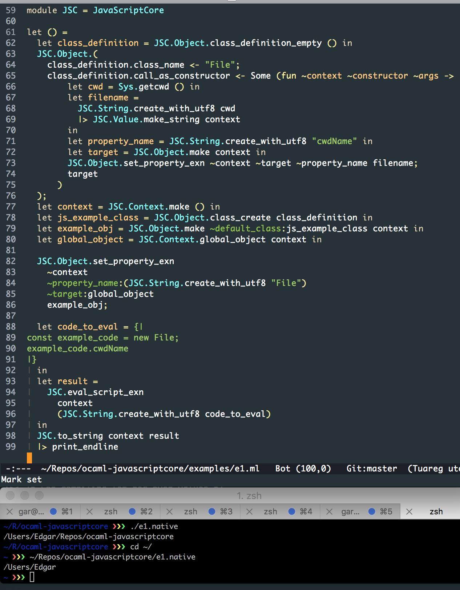

JavaScriptCore in OCaml
==========================

If you understand this image then you understand what this project is
about and what its capable of.



# Installation (Tested on OS X and Ubuntu 14, 15)

`opam` makes this installation very easy, even taking care of system
dependencies for you.

In this directory do:

```shell
$ opam pin add javascriptcore . -y
```

If on Linux then this will probably crap out at first. That is fine,
there will be a `depext` message, follow that message and `opam` will
take care of all the required system dependencies. Then do the `opam
pin` operation again.

# Notes

If building this code with the environment varible `JSC_ML_DEBUG`
defined, then you'll get colored debugging information printed out
from each of the stub functions at the C/C++ layer, for example:

```shell
$ JSC_ML_DEBUG= opam pin add javascriptcore . -y
```

Or during development

```shell
$ JSC_ML_DEBUG= make
```

An example `utop` session:

```shell
─( 16:02:44 )─< command 0 >─────────────────{ counter: 0 }─
utop # #require "javascriptcore";;
─( 16:02:44 )─< command 1 >─────────────────{ counter: 0 }─
utop # let s = new JavaScriptCore.Objects.js_string ~ml_string:"Hello World" ();;
[2016-06-16.16:02:47] [value jsc_ml_make_string_with_ml_str(value)]: Creating JSStringRef from OCaml String
val s : JavaScriptCore.Objects.js_string = <obj>
─( 16:02:55 )─< command 2 >─────────────────{ counter: 0 }─
utop # s#length;;
[2016-06-16.16:02:55] [value jsc_ml_jsc_length(value)]: Getting JSC String length
- : int = 11
```

# Example
All of this is of course subject to change as I'm feeling out the APIs
but here's one example.

```ocaml
let () =
  let vm = new JavaScriptCore.virtual_machine () in
  let date = vm#make_js_date () in
  if date#has_property "setYear"
  then print_endline "setYear is a real property of a JS Object"
  else prerr_endline "setYear should have existed"

```

(Assuming that library was built with the `JSC_ML_DEBUG defined`)
and all you'd need to compile and run would be: 

```shell
$ ocamlfind ocamlopt -package javascriptcore e.ml -linkpkg -o T
$ ./T
[2016-06-19.15:57:11] [value jsc_ml_make_vm(value)]: Creating a JSC Global Context, aka a Virtual Machine
[2016-06-19.15:57:11] [value jsc_ml_set_context_name(value, value)]: Setting Context Name
[2016-06-19.15:57:11] [JSStringRef ml_string_to_jsc_string(value)]: Converting OCaml string to JSC string
[2016-06-19.15:57:11] [value jsc_ml_make_date_now(value)]: Creating JSC Date with no arguments
[2016-06-19.15:57:11] [JSStringRef ml_string_to_jsc_string(value)]: Converting OCaml string to JSC string
setYear is a real property of a JS Object
```

# Backing 

This project is built with OCaml 4.03.0, C++11, libc++,
JavaScriptCore. It does not use objective-c and works on Linux.

# Help Wanted

This project has plenty of places to improve your JavaScript, OCaml,
C/C++ coding.
